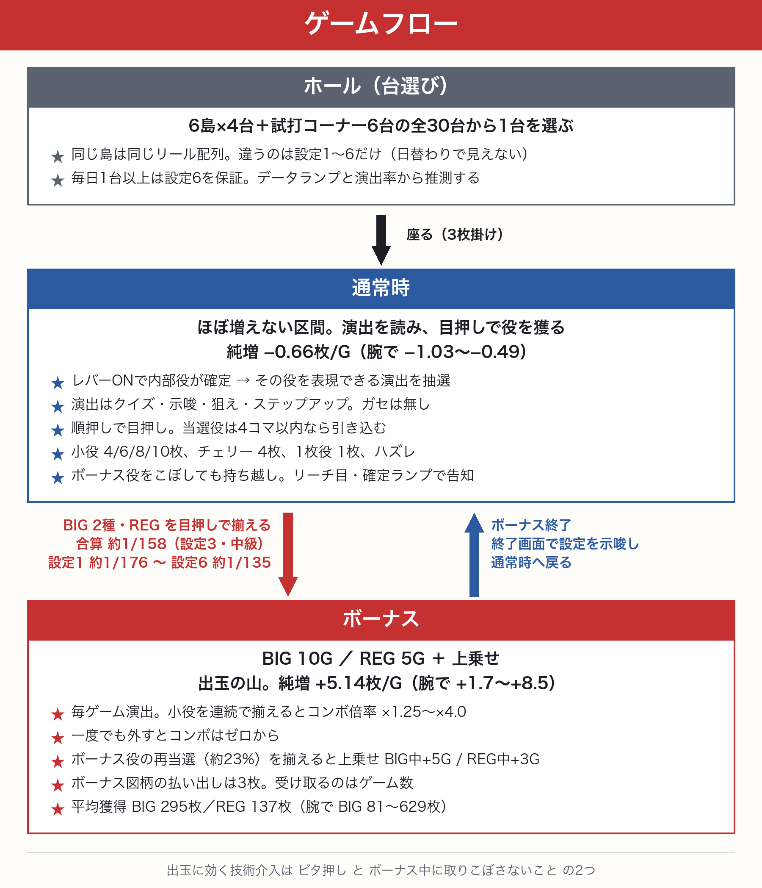

# mojislot-web

3文字の日本語（ひらがな/カタカナ）を作り出すパチスロ風ゲーム。目押し（ビタ押し）で役を狙う、**技術介入が主軸**のゲーム。

**▶ 遊ぶ: https://mojislot.tukiguti.com/**

---

## 文字スロ ―MOJISLOT―

### 読めるか、狙えるか。**言葉で獲る、技術介入ノーマル機。**

運で引くゲームじゃない。腕で獲るゲームだ。  
ボーナスを射止め、目押しをねじ込み、ゲーム数を上乗せろ。

通常時は耐える時間。メダルを削られながら、フラグが降りてくるその瞬間を待つ。  
レバーを叩いた瞬間、当否はすでに決まっている。  
あとは――それを己の手で引き寄せられるかどうかだけだ。

演出に一切の嘘はない。ガセ前兆など1コマたりとも存在しない。  
内部で成立していない役は、どこをどう押そうが絶対に揃わない。  
だからこそ、リールに刻まれた出目はすべて、あなたが実力で掴み取った証拠だ。

打ち方は順押しのみでいい。  
小難しい知識などいらない。問われるのは、狙うべき位置を見極める観察眼だけ。  
目押しをミスすれば、外れた出目が1枚役となって虚しく通り過ぎる。

赤が閃けばレギュラーボーナス、金が輝けばビッグボーナス。  
その瞬間を見逃さず、図柄をねじ込め。

**――ボーナス突入。ここからが真の勝負だ。**

ボーナス中は毎ゲームが好機。小役を途切れず揃え続けろ。  
コンボを継続させるほど、1枚の価値は跳ね上がる。  
ただし、一度でも目押しを外せばリセット。容赦なくゼロからやり直しだ。

さらに――ボーナス中にも再び赤が迫る、金が降る。  
その図柄を完璧に揃えろ。ゲーム数がダイレクトに上乗せされる。

上乗せにリミッターは存在しない。  
技術で繋ぎ止める限り、ボーナスが終わることはない。

> 直感を研ぎ澄まし、見極めて、止める。
> それこそが、この台のすべてだ。

**― ツキグチ機工 ―**

---

## ゲームフロー



```
レバーON → 内部役を抽選（実機のフラグ）→ その役を表現できる演出を抽選
  │
通常時（ほぼ増えない＝実機のコイン持ち）
  ├─ クイズ … 答えの単語を自分で考え、その3文字を狙う
  ├─ 示唆   … 候補役を並べて「どれかな…？」（青・緑=小役／赤=REG／金=REGかBIG／虹=BIG確定）。当たり役が中段に来たら「狙え！」へ発展
  ├─ 狙え！ … 予告された3文字を狙う
  ├─ ステップアップ … 画面が青く光り、停止ごとに色が上がる。終了色が**次ゲーム**を予告する
  ├─ 1枚役 … 専用の並び（単語にならない3文字）が自動で揃って1枚
  └─ ハズレ … 何も揃わない＝0枚
       │
       └─ 赤/金示唆・BB/RB予告を目押しで揃える ──▶ ボーナス突入
                                                     │
ボーナス中（演出100%・出玉の山）◀───────────────────┘
  ├─ 小役を連続で揃える → コンボ倍率が上昇
  └─ ボーナス役をもう一度揃える → ゲーム数上乗せ（BIG中 +5G / REG中 +3G・上限なし）
```

**ボーナスはステップアップ経由でしか来ない。** 通常の抽選からは BIG と REG を落として
あり、契機役（チェリーと払い出しの大きい小役）の一部がステップアップへ入って、その
終了色で次ゲームが決まる。

| 終了色 | 出現率 | 次ゲームがボーナス | うちBIG |
|---|---:|---:|---:|
| 青 | 45% | 12% | 15% |
| 緑 | 35% | 53% | 24% |
| 赤 | 18% | 70% | 35% |
| 金 | 2% | 100% | 92% |

## スペック（本番ロジックをそのまま回したシミュレーション実測値・100万G×全5章・設定3）

**数値は中級（±50ms・ボーナス中の目押し成功率90.8%）のもの。** 腕で大きく動くので、
他の腕は下の「機械割は腕で決まる」を参照。

| 項目 | 数値 |
|---|---|
| リール | 3リール21コマ / **5ライン**（横3＋斜め2） |
| 規定 | 3枚掛け |
| 内部役 | **10種**（ハズレ／1枚役／小役4／チェリー／REG／BIG×2）。押し順は役ではなく停止制御の入力 |
| 示唆tier | **青・緑・赤・金・虹の5色**。青と緑が小役（緑はチェリーを含む）、赤がREG、金はREGかBIG、**虹はBIG確定**。色は当選カテゴリの**情報のみ**で引き込みは変えない |
| ステップアップ | 契機役の 5.5% が突入。終了色は **青／緑／赤／金** で、指すのは**次ゲーム** |
| **BIG** | 10G＋α ／ 平均 **295枚**。αは上乗せ（腕で 81〜629枚） |
| **REG** | 5G＋α ／ 平均 **137枚**（腕で 39〜298枚） |
| 合算突入率 | **1/154**。上手いほど数字が大きく見える（腕で 1/146〜1/166）のは、**ボーナスが長く伸びて全体に占める通常時の割合が下がる**ため——分母は総ゲーム数で、おかわりは回数に数えない。通常時だけで見た当選率は腕で変わらない（持ち越しがあるので） |
| ゲーム数上乗せ（おかわり） | ボーナス中の **約23%** のゲームで当選。**揃えれば** BIG中 +5G / REG中 +3G。**上限なし**——繋げた分だけ終わらない |
| ボーナス図柄の配当 | **3枚**（＝BET と同額）。実機のボーナス成立がリプレイ相当なのと同じで、受け取るのは枚数ではなく**権利**。通常時の初当たりも同じ |
| 通常時の純増 | **−0.66枚/G**（＝削られる時間。実機のコイン持ちに相当） |
| ボーナス中の純増 | **+5.14枚/G**（出玉はここに集約。腕で +1.7〜+8.5枚） |
| **機械割** | **107.6%**（設定3）─ 動かすのは**腕（目押し＋出目の読み）**で、73%〜148%まで開く。設定でも動く |
| 設定 1〜6 | 台ごとに日替わり。見えないので**データと演出の出方から推測する**（差は主に演出の出方に乗せてある） |
| ボーナス持ち越し | こぼしても**フラグは消えない**（実機のノーマル機と同じ）。演出が無いゲームでこぼしたら確定ランプが必ず点き、演出が出ていたゲームは50%。点かなければ**リーチ目**を読んで自力で揃える |
| リーチ目 | **第1停止**の中段に**ボーナス役にしか使わない図柄**が出たらボーナス確定。停止テーブルが非ボーナス時はそこに止めないため誤告知は起きない（持ち越し中の43〜89%で出現・腕による） |
| 確定告知ランプ | 1/303（点灯＝次ゲーム以降ボーナス確定・告知あり） |
| チェリー重複 | チェリー成立の **5%** でランプ点灯（実機のレア役＋ボーナス同時当選） |
| フリーズ | 1/2000（倍速回転から**自動で7揃い**） |
| リール速度 | 既定 **24コマ/秒**（1周0.88秒 / 1コマ42ms）。設定のスライダーで **20〜28** を自分で選べる |
| ビタ押し判定 | **±12ms**（速度に依らず固定）。役に必要なリールを**1本残らず自力で止めた**時だけ配当に上乗せ（×1.15）。**出玉に効く技術介入はこれと、ボーナス中に取りこぼさないことの2つだけ**——狙え・クイズの的中に付けていた加算は廃止した |

**機械割は腕で決まる**（既定の24コマ/秒）：

| 腕（目押し誤差） | ボ中の成功率 | 機械割 | 通常時純増 | ボーナス中純増 | 突入 | BIG平均 | REG平均 |
|---|---:|---|---|---|---|---|---|
| 初心者（±100ms） | 72.1% | **72.7%** | −1.03枚 | +1.70枚 | 1/146 | 81枚 | 39枚 |
| 中級（±50ms） | **90.8%** | **107.6%** | −0.66枚 | +5.14枚 | 1/154 | 295枚 | 137枚 |
| 上級（±25ms） | 97.6% | **146.1%** | −0.50枚 | +8.18枚 | 1/166 | 613枚 | 291枚 |
| 神（±10ms） | 98.0% | **148.1%** | −0.49枚 | +8.45枚 | 1/166 | 629枚 | 298枚 |

**差が付くのはボーナス中。** ボーナス中に取りこぼすと上乗せの抽選を受け損ねるので、
こぼし率（初心者27.9% / 神2.0%）がそのままゲーム数の差になる。初心者と神で
BIG平均が 81枚と629枚——**同じ10Gから始まって、8倍近く違う**。

設定でも動く（中級の場合）:

| 設定 | 1 | 2 | 3 | 4 | 5 | 6 |
|---|---|---|---|---|---|---|
| 機械割 | 103.5% | 105.6% | 106.8% | 109.9% | 113.0% | 114.4% |
| 突入 | 1/176 | 1/166 | 1/158 | 1/149 | 1/141 | 1/135 |

※ 示唆は「候補から1つを選んで狙う」（正解を知らない）前提でシミュレートしている。
※ 確定告知ランプとチェリー重複（＝次ゲーム以降ボーナス確定の持ち越し）も込みで測定している。
※ 突入が腕でほとんど変わらないのは、**こぼしてもフラグが消えない**ため。腕の差は
「持ち越しを何ゲームで回収できるか」と「ボーナス中に何枚取れるか」に出る。

再現方法: `SIM=1 SPINS=1000000 npx vitest run tests/sim/payout-sim.test.ts`（本番クラスをそのまま使用）。
**20万Gだと腕どうしが同じ乱数列を共有しているぶん相関が強く、±2pt はノイズで出る。**

## 特徴

- **5章**（寿司 / 動物 / 動詞 / 八百屋 / セキュリティ）。役もクイズも図柄も章ごとに総入れ替え。表示名に文字種は入れない（ホールの島看板に出るため）
- **台を選ぶところからゲーム**：章のカードではなく、**ホールの全29台から1台を選ぶ**（6島×4台＋試打コーナー5台）。入口 → 島 → 台に寄る、の3段階。同じ島の4台は**リール配列が同じで違うのは設定だけ**なので、覚えた配列は島の中で持ち越せる。設定は見えず、データカウンターと演出の出方から推測する。差の主役を演出に置いてあるので、**腕がある人ほど設定差が大きく出る**（設定1→6で中級11ポイント）
- **設定6は毎日1台以上ある**：抽選任せだと設定6が0台の日が出て「探しても答えが無い日」ができるので、1台は確定で置いてある。読める数字は**演出が出た割合**だけ（2台を3σで見分けるのに演出率なら約400G、合成確率だと約278,000G）なので、それをデータカウンターに出している。探すのが面倒な日の逃げ道として**試打コーナー**（全機種1台ずつ・全台設定6）があり、そこでの記録はランキングの比較条件で既定除外される
- 役駆動設計：1章あたり コア4役＋チェリー＋RB＋プレミアム2（7揃い／バー揃い）
- **クイズ 105問**（各章21問）。答えの単語を自分で思い出し、その文字を目押しで狙う
- **BIG/REG 二段ボーナス**。出玉の山はボーナス中の **コンボ（連チャン）** と **ゲーム数上乗せ** に集約
- **ボーナス図柄は配当ではなく権利**：揃えて受け取るのは**ゲーム数**であって枚数ではない。払い出しは BET と同額の3枚（実機のボーナス成立がリプレイ相当なのと同じ）。初当たりも上乗せも同じ扱い
- **上乗せは腕で起きる**：ボーナス中の約23%で再当選するが、**揃えなければ乗らない**。ボーナス中の目押し成功率は初心者72.1% / 中級90.8% / 上級97.6%で、これがそのままゲーム数の差になる。BIG平均は初心者81枚に対し上級613枚。出玉に効く技術介入は**ビタ押し**と**ボーナス中に取りこぼさないこと**の2つで、演出の的中に配当は付かない（狙え・クイズの加算は廃止）
- **実機準拠のテーブル制御**：レバーONで内部役（フラグ）を確定し、**当選役以外は4コマ以内で決定的に蹴る**。引き込み（演出の補助）も同じ制御に従い、**非当選役がロックする位置へは引き込まない**。リール配列もこの制御に合わせて構築的に設計してあり、**「役が揃って見えるのに0枚」は全押下位置で発生しない**（`tests/audit/` の2監査＝蹴り経路50万通り＋引き込み経路44万通り×5章で保証）
- **順押し前提**：押し順は「役の種類」ではなく**停止制御の入力**。プレイヤーは左→中→右で打てばよく、押し順を覚える必要は無い
- **制御は内部役だけで決まる（実機準拠）**：引き込み窓は**演出では変わらない**一律4コマ（実機の最大スベリ）。狙えでも青示唆でも難易度は同じで、違うのは「何が分かるか」だけ。**難易度を作るのはリール配列**（図柄の間隔が広いほど4コマでは届かず取りこぼす）＝実機と同じ構造
- **リーチ目と持ち越し**：ボーナスをこぼしても**フラグは消えず**（実機のノーマル機と同じ）、以降は演出も告知も出ない。代わりに**リーチ目**が出る——各リールには「ボーナス役にしか使わない図柄」があり、停止テーブルが**非ボーナス時は第1停止でそれを中段に止めない**よう組んであるので、**第1停止の中段に出た＝ボーナス確定**になる（実機の「左中段◯◯」と同じ）。持ち越し中の43〜89%で出現し（腕による）、読めた人はそこから自力で揃えに行く
- **停止テーブル**：第1停止のスベリを `data/stops/*.json` に「内部役 × リール × 押下位置 → スベリコマ数」の表として持つ（実機のリール制御表）。第1停止はまだどの役もロックし得ない＝出目が完全に自由なので、**ここを手で書き換えてリーチ目・入り目を1つずつ設計できる**。②ゼロ保証は第2・第3停止の蹴りが守るので、書き換えても崩れない（監査がテーブル経由で全押下位置を検証）
- **1枚役**：実機の制御用1枚役に相当する**実在の並び**（各章2〜3種・既存文字の「単語にならない」3文字）。当選時は自動で引き込まれて1枚。窓外ならこぼれる（引き込みカバー率 約76〜90%）
- **示唆＝「どれかな…？」**：示唆はカテゴリしか示さないので、**その色で当たりうる役を全部並べて**提示する（嘘は混ぜない＝並ぶのは本当に当たりうる役だけ）。第1・第2停止にも引き込みがあり、**当たり役の図柄が中段に来た瞬間に候補が1役へ絞られ「狙え！」に発展**する（約72%）。外せば候補は絞られないまま＝自力
- **チェリー重複**：チェリーは2文字役で他の小役と質が違うレア役。**揃えた時の5%で確定告知ランプが点灯**し、次ゲーム以降がボーナス確定になる（実機のレア役＋ボーナス同時当選）。ボーナス全体の9〜12%がこの経路
- **ガセ演出なし**：演出はすべて引き込みを伴う。演出は「内部役を示す表現」であって払い出しの正本ではない
- **モーションブラー**：回転中の図柄に縦方向の残像を速度比例でかける。これにより**実機速度域（24〜28コマ/秒）でも図柄を追える**（ブラーが無いとコマ送りに見えてカクつくため、以前は20コマ/秒に落としていた）。停止した瞬間に0へ戻すので出目はくっきり読める
- **見やすさは自分で決める**：**リール速度（20〜28コマ/秒）とブラー強さ（0.00〜1.00）を設定のスライダーで調整**。どちらもドラッグ中に即反映されるので、回しながら好みの値を探せる（滑らかさ ⇄ 目押しのしやすさのトレードオフ）
- **内部役テーブルは章データに集約**：`data/yaku/*.json` の `internalRoles` が抽選の正本。表示役とは分離してある。演出レート・目押し補助・リール速度・ブラー既定値は **`data/tuning/default.json`**、配当は **`data/payouts/default.json`**（データ駆動）
- **ステップアップ予告**：レバーで画面が青く光り、停止ごとに色が上がる（青→緑→赤→金）。**指しているのは次ゲーム**で、色が上がらないこと自体も情報になる。他の演出とは重ねない——どちらも画面全体を色で塗るので、重ねるとどちらが何の話か読めなくなる
- **データランプ**：筐体の上に載る表示器。スランプグラフ（差枚の折れ線に BIG/REG の位置を縦線で重ねる）、BB/RB 回数、合算・BB・RB の各確率、ボーナス間ゲーム数、演出率。実機のホールと同じで、台が変わっても表示器は同じものが並ぶ
- **演出データ**：演出ごとの発生回数と、そこからボーナスへ繋がった回数、期待度。**仕様書の期待度は出さない**——出した瞬間に示唆を読む遊びが消えるので、自分が引いた実績だけを数えて見せる
- **筐体の皮**：ロイヤル（クローム×紫×金）／ミッドナイト（黒×電光シアン）／レトロ（木目×クリーム×赤7セグ）を設定から切り替え
- **キーは変えられる**：既定はベットもレバーもスペース（1回でベット、もう1回で回転）。設定で別々のキーにも割り振れる。**押す位置は成績に直結する**（ビタ押しの判定は±12ms）ので、見た目の好みではなく遊びやすさの設定として扱う
- 計数履歴にはルール版、使用速度、AUTO使用、ミッション、デバッグ有無を保存。旧履歴は条件不明として互換表示

## 技術スタック

- **Vite** + **TypeScript**
- **Pixi.js v8**（ゲーム画面のレンダリング）
- **DOM + CSS**（UI レイヤ・演出オーバーレイ）
- **Zod**（JSONスキーマバリデーション）
- **LocalStorage**（セーブ／カード）
- **Vitest**（ユニットテスト）

## 開発

```bash
npm install
npm run dev      # 開発サーバ
npm run build    # 本番ビルド（tsc + vite）
npm run preview  # ビルド成果物のローカル確認
npm test         # Vitest によるユニットテスト
```

## ディレクトリ構成

```
src/
├── main.ts          # エントリーポイント（Pixi 初期化 + DOM 接続・演出の出し分け）
├── core/            # 描画非依存のゲームロジック
│                    #   StopController  停止制御の唯一の実装（本体・監査・シミュレーター共通）
│                    #   RoundResolver   全停止時の成立判定と払い出し合成
│                    #   ReelEngine / YakuJudge / PayoutCalc / Paylines / ReachEyes
├── productions/     # 演出ロジック（描画非依存）
│                    #   BonusSession      ボーナス区間（突入〜消化しきり）の会計
│                    #   EffectEligibility 演出の可否判定と示唆候補の逆算
│                    #   EffectScheduler / BonusZone / SlipResolver / TenpaiDetector 等
├── render/          # Pixi 描画層（ReelView/EffectVisual/JinView 等）
├── ui/              # DOM UI 層（Effects/SettingsOverlay/ZukanOverlay 等）
├── card/            # 図鑑・統計・セーブ（カード）のコーデック/管理
├── audio/           # 効果音・BGM（Web Audio 合成）＋ 出題者のボイス（VOICEVOX の m4a）
├── router/          # 画面ルーティング
├── data/            # JSON ロード + Zod 検証（schemas/chapters）
└── lib/             # 汎用ユーティリティ（Observable 等）

data/                # ゲームデータ（JSON・Zod 検証）
├── reels/           # 章ごとのリール配列（21コマ×3）
├── stops/           # 章ごとの停止テーブル（第1停止・手編集可）
├── yaku/            # 章ごとの役定義
├── quizzes/         # 章ごとのクイズ（各21問）
├── payouts/         # 配当（default.json）
└── tuning/          # 演出レート・補助・蹴り・予告の重み等（default.json）

public/art/          # 画像（カットイン・図柄・狙え等の webp）
tests/               # Vitest によるユニットテスト
```

## 企画ドキュメント

詳細な設計は `zikken/playground/mojislot-plan/` で管理：
https://github.com/tukiguti/zikken/tree/main/playground/mojislot-plan

出玉モデルの設計と実測は [21_payout-rebalance.md](https://github.com/tukiguti/zikken/blob/main/playground/mojislot-plan/21_payout-rebalance.md) §8 を参照。

## ライセンス

未定（リリース時に決定）
